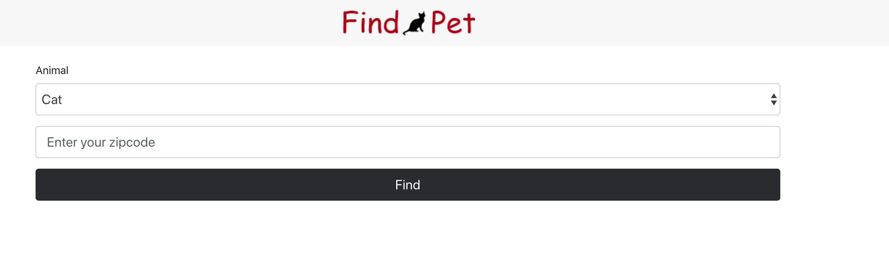
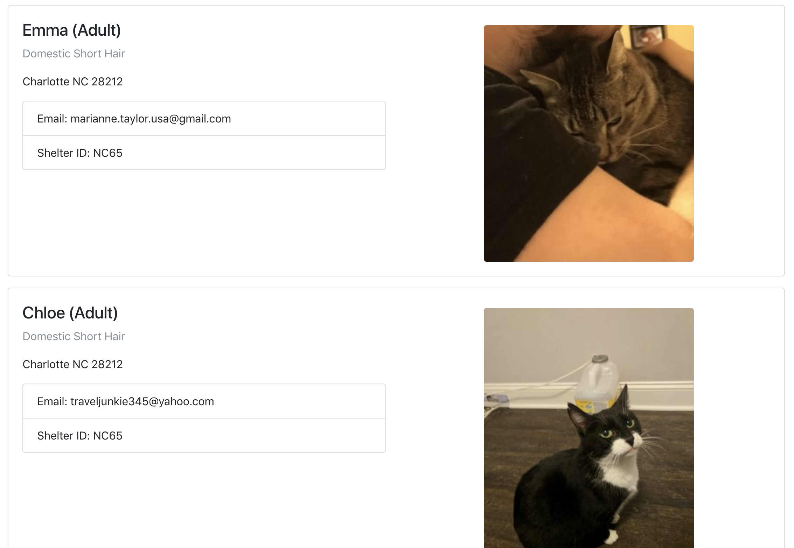

# find-a-pet
Simple pet finder app to fecth PetFinder data using their API based on location entered.

**Quick Start**
Add your own API key to main.js

```
# Install dependencies
npm install

# Serve on localhost:1234
parcel index.html

# Build for prod
parcel build
```


Screenshots:

Initial search:


Once pets are retrieved

